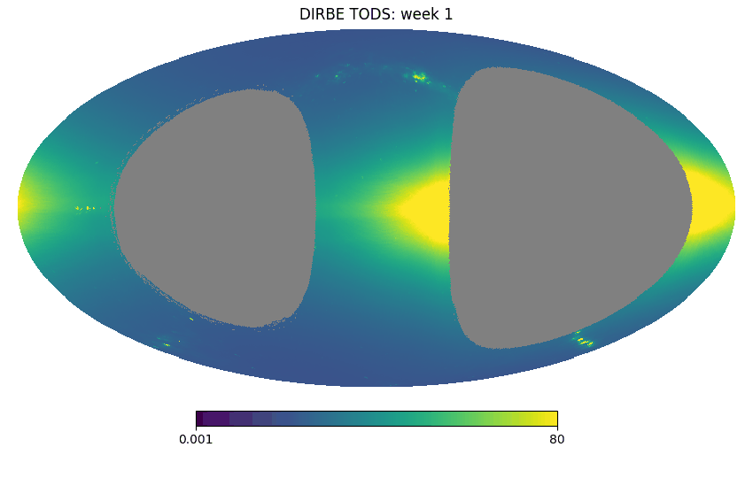
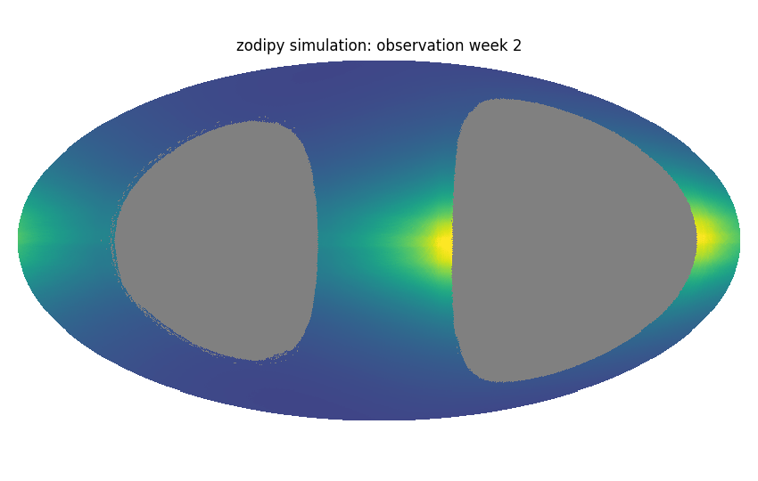

[](https://badge.fury.io/py/zodipy)

[](http://www.astropy.org/)


---


*Zodipy* is a Python simulation tool for Zodiacal Emission (Interplanetary Dust Emission). It allows you to compute the 
simulated interplanetary dust emission for a timestream of pixels, or at an instant in time.


## Installing
Zodipy is available at PyPI and can be installed with ``pip install zodipy``.

## Features
The full set of features and use-cases will be documentated in the nearby future.

**Initializing an Interplantery Dust Model:** *Zodipy* implements the [Kelsall et al. (1998)](https://ui.adsabs.harvard.edu/abs/1998ApJ...508...44K/abstract) Interplanetary Dust Model. Additionally, it is possible to include the various emissivity fits from the Planck collaboration.
```python
from zodipy import Zodipy

model = Zodipy(model="DIRBE")
```

**Instantaneous emission:** We can make a map of the simulated instantaneous emission seen by an observer using the `get_instantaneous_emission` function, which queries the observer position given an epoch through the JPL Horizons API:
```python
import healpy as hp
import astropy.units as u

emission = model.get_instantaneous_emission(
    800*u.GHz, 
    nside=256, 
    observer="Planck", 
    epochs=59215,  # 2010-01-01 (iso) in MJD
    coord_out="G"
)

hp.mollview(emission, norm="hist")
```


The `epochs` input must follow the convention used in [astroquery](https://astroquery.readthedocs.io/en/latest/jplhorizons/jplhorizons.html). If multiple dates are passed to the function, the returned emission becomes the average over all instantaneous maps.

The individual components can be retrieved by setting the keyword `return_comps=True`. Following is an example of the simulated *instantaneous emission* with Zodipy seen from L2 for each component at October 6th 2021.


**Time-ordered emission:** We can make a time-stream of simulated emission for a sequence of time-ordered pixels using the `get_time_ordered_emission` function. This requires specifying the heliocentric ecliptic cartesian position of the observer (and optionally the Earth) associated with each chunk of pixels. In the following we use the first day of time-ordered pixels from the DIRBE instrument of the COBE satellite (Photometric Band 6, Detector A, first day of observations) to make a simulated time-stream:
```python
import astropy.units as u
import matplotlib.pyplot as plt
from zodipy import Zodipy

model = Zodipy()

# Read in DIRBE tod information
dirbe_tods = ...
dirbe_pixels = ...
dirbe_position = ...  

timestream = model.get_time_ordered_emission(
    25*u.micron
    nside=128,
    pixels=dirbe_pixels,
    observer_pos=dirbe_position,
    color_corr=True, # Include the DIRBE color correction factor
)

plt.plot(dirbe_tods, label="DIRBE TODS")
plt.plot(timestream, label="Zodipy simulation")
plt.legend()
plt.show()
```


**Binned time-ordered emission:** By setting `bin=True` in the function call, the simulated emission is binned into a HEALPIX map. In the following, we compare *Zodipy* simulated maps with the observed binned time-ordered data by DIRBE in week maps.

```python
import astropy.units as u
import matplotlib.pyplot as plt
from zodipy import Zodipy

model = Zodipy()

nside = 128
wavelen = 25*u.micron

dirbe_tod_chunks = [...]
dirbe_pixel_chunks = [...]
dirbe_positions = [...]

emission = np.zeros(hp.nside2npix(nside))
hits_map = np.zeros(hp.nside2npix(nside))   
    
for day, (pixels, dirbe_pos) in enumerate(
    zip(dirbe_pixel_chunks, dirbe_positions),
    start=1
):
    
    # Get unique pixel hit and numbers to build hits_map
    unique_pixels, counts = np.unique(pixels, return_counts=True)
    hits_map[unique_pixels] += counts

    emission += model.get_time_ordered_emission(
        wavelen,
        nside=nside,
        pixels=pixels,
        observer_pos=dirbe_position,
        bin=True,
        color_corr=True
    )

    if day % 7 == 0:
        zodi_emission /= hits_map
        hp.mollview(zodi_emission)

        # Reset emission and hits map for next week
        emission = np.zeros(hp.nside2npix(nside)) 
        hits_map = np.zeros(hp.nside2npix(nside)) 
```

 

