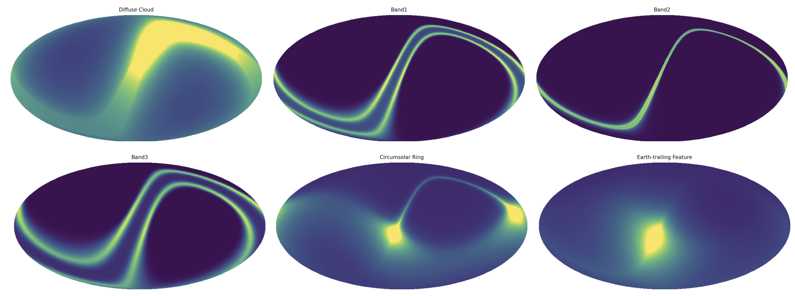
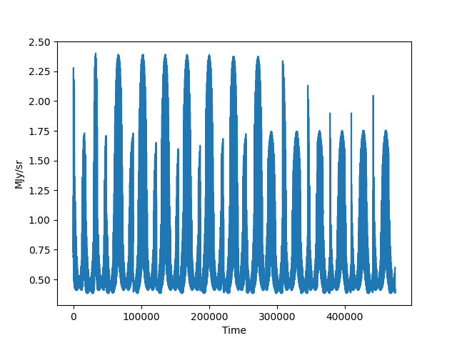
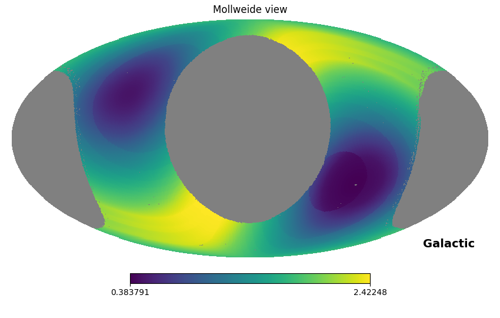

[](https://badge.fury.io/py/zodipy)

[](http://www.astropy.org/)


---


*Zodipy* is a Python simulation tool for Zodiacal Emission (Interplanetary Dust Emission). It allows you to compute the 
simulated emission in a timestream, or at an instant in time.


## Installing
Zodipy is available at PyPI and can be installed with ``pip install zodipy``.

## Features
The full set of features and use-cases will be documentated in the nearby future.

**Initializing an Interplantery Dust Model:** We start by selecting which Interplanetary Dust Model to use. Currently, the implemented options are the [Kelsall et al. (1998)](https://ui.adsabs.harvard.edu/abs/1998ApJ...508...44K/abstract) model with or without the various emissivity fits from the Planck collaboration.
```python
import zodipy

# Other options for models are "K98", "Planck13", "Planck15"
model = zodipy.InterplanetaryDustModel(model="Planck18")
```

**Instantaneous emission:** By obtaining the coordinates of an observer through the JPL Horizons API, we can simulate the full sky at an instant in time as follows:
```python
import healpy as hp

epoch = 59215  # 2010-01-01 in Modified Julian dates
emission = model.get_instantaneous_emission(
    nside=256, 
    freq=800, 
    observer="Planck", 
    epochs=epoch
)

hp.mollview(emission, norm="hist", coord=["E", "G"])
```


The `epochs` input must follow the convention used in [astroquery](https://astroquery.readthedocs.io/en/latest/jplhorizons/jplhorizons.html). If multiple dates are used as epochs, the returned emission will be the average emission over all instantaneous maps.

Additionally, it is possible to retrieve the emission of each Zodiacal Component in a dictionary, if the parameter `return_comps` is set to `True`. Following is an example of what each component may have looked like at 6th of October 2021.




**Time-ordered emission:** For a chunk of time-ordered data, it is possible to compute the simulated Zodiacal Emission over each observed pixel. In the following example we simulate the Zodiacal Emission time-stream given a chunk of the time-ordered pixels from the DIRBE instrument of the COBE satellite (Photometric Band 8, Detector A, first day of observations):
```python
import matplotlib.pyplot as plt
import zodipy

model = zodipy.InterplanetaryDustModel(model="K98")

dirbe_pixel_timestream = ...    # Get in DIRBE tods
dirbe_coords = ...  # Get coords of DIRBE at the time corresponding to the tod chunk 
earth_coords = ... # Get coords of the Earth at the time corresponding to the tod chunk 
dirbe_freq = 974    # GHz
dirbe_nside = 128

timestream = model.get_time_ordered_emission(
    nside=dirbe_nside,
    freq=dirbe_freq,
    pixels=dirbe_pixel_timestream,
    observer_coordinates=dirbe_coords,
    earth_coordinates=earth_coords
)

plt.plot(timestream)
```



**Binned time-ordered emission:** By setting the optional `bin` parameter to `True`, the emission is binned into a map which we can visualize as follows:

```python

# Get three tod chunks, each corresponding to a day of observation
pixel_chunks = [...]
dirbe_coords = [...]
earth_coords = [...]

# Initialize empty emission and hit maps array
emission = np.zeros(hp.nside2npix(nside))
hits_map = np.zeros(hp.nside2npix(nside))   
    
    # Loop over tod chunks
    for pixels, dirbe_coords, earth_coords in zip(pixel_chunks, dirbe_coords, earth_coords)):
        
        # We construct the total hits map over all chunks so that we can
        # normalize the output map
        unique_pixels, counts = np.unique(pixels, return_counts=True)
        hits_map[unique_pixels] += counts

        emission += model.get_time_ordered_emission(
            freq=freq,
            nside=nside,
            pixels=pixels,
            observer_coordinates=dirbe_coords,
            earth_coordinates=earth_coords,
            bin=True,
        )

emission /= hits_map

hp.mollview(emission, norm="hist", coord=["E", "G"])
```

