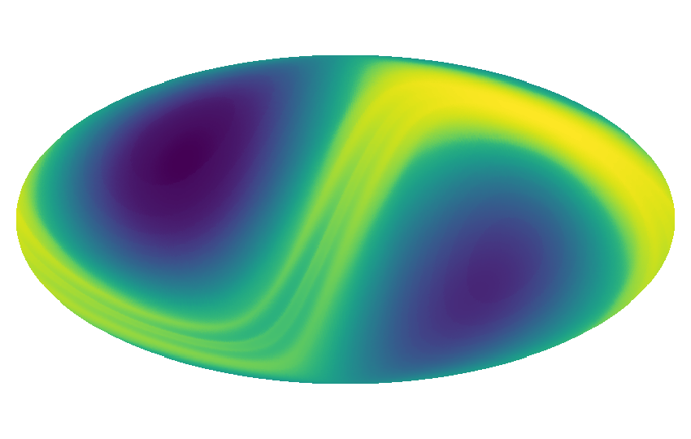
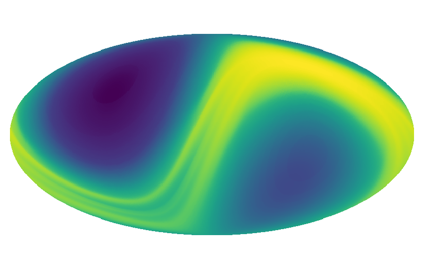
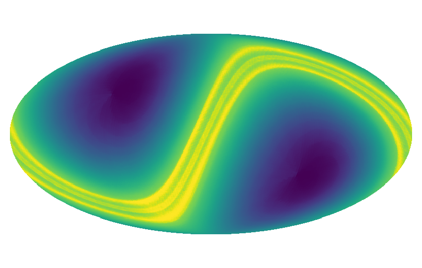

[](https://badge.fury.io/py/zodipy)
[](http://www.astropy.org/)

# Zodipy

## Description
Zodipy is a python tool that simulates the Zodiacal emission.

## Installing
Zodipy is installed with `pip`.
```bash
pip install zodipy
```

## Usage
The following examples are meant to provide an overview of how Zodipy may be
used to produce simulations of the Zodiacal emission. A more in-depth
documentation will be available in the near future.

## Simulating the instantaneous emission from a single observation
The simplest use case of Zodipy is to simulate the instantaneous emission as
seen from a major body or a location in the Solar system, as of today:
```python
import zodipy

zodi = zodipy.Zodi()
emission = zodi.get_emission(nside=128, freq=800)
```
Calling the `Zodi` object with no arguments will by default set up the initial
conditions of the simulation for an observer at L2 today. The `get_emission`
method of the `Zodi` object, is then called to simulate and return the emission
for a given nside and frequency. 

We can visualize the above simulated emission using Healpy:



Alternatively, a specific observer and specific epochs can be passed as
arguments to the `Zodi` object. The `epochs` object must match one of the
possible formats defined in [astroquery's JPL Horizons
api](https://astroquery.readthedocs.io/en/latest/jplhorizons/jplhorizons.html).

```python
import zodipy

MJD = 59215  # 2010-01-01 in Modified Julian dates
zodi = zodipy.Zodi(observer='Planck', epochs=MJD)
emission = zodi.get_emission(nside=128, freq=800)
```


To return the component-wise emission the keyword `return_comps` in the
`get_emission` function may be set to True.

## Simulating the pixel weighted average over multiple observations
By providing multiple dates in the `epochs` argument to `Zodi`, the
`get_emission` function will return the emission averaged over all observations.

It is possible to provide hit maps for each respective observation given by
`epochs`. This is done by passing a sequence of hit maps through the `hit_maps`
argument in `Zodi`. 

Below is an example where we simulate the
pixel weighted average over daily observations over a year:
```python
import zodipy

epochs = {
    'start': '2010-01-01', 
    'stop': '2011-01-01', 
    'step' : '1d'
}
hit_maps = ... # Your sequence of hit_maps for each observation in epochs 

zodi = zodipy.Zodi(observer='Planck', epochs=epochs, hit_maps=hit_maps)
emission = zodi.get_emission(nside=128, freq=800)
```


This simulation closely resembles map making in the time-ordered domain, with
the hit maps playing a significant role on the outputted emission due to the
motion of Earth through the interplanetary dust.

The hit maps used in the above example was somewhat arbitrarily chosen (stripes
of 10 degrees perpendicular to the ecliptic).

## Interplanetary dust models
Zodipy uses the [Kelsall et al.
(1998)](https://ui.adsabs.harvard.edu/abs/1998ApJ...508...44K/abstract)
Interplanetary dust model. The line-of-sight integrals are computed using the
definition in [Planck 2013 results. XIV. Zodiacal
emission](https://arxiv.org/abs/1303.5074). During the Planck analysis, three
different sets of emissivities were fit to describe the emission. These can be
selected by providing the keyword argument `model` to the `Zodi` object:
```python
import zodipy

zodi = zodipy.Zodi(model='planck 2013')
```
The available models are 'planck 2013', 'planck 2015', and 'planck 2018'. The
default is the 2018 model. Note that selecting the 2013 model will include the
Circumsolar and Earth-trailing components, which were left out in the 2015 and
2018 Planck analyses.