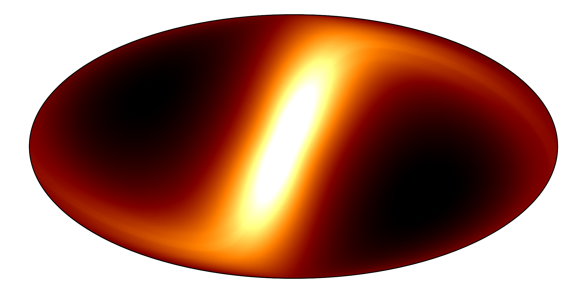

[](https://badge.fury.io/py/zodipy)

[](http://www.astropy.org/)


---


*Zodipy* is a Python tool for simulating the Interplanetary Dust Emission that a Solar System observer sees, either in the form of timestreams or binned HEALPIX maps.




# Usage
A full introduction to *Zodipy* and its use-cases can be found in the [documentation](https://zodipy.readthedocs.io/en/latest/).

**Interplanetary Dust models:** select between built in models.
```python
from zodipy import Zodipy

model = Zodipy(model="DIRBE") # DIRBE
model = Zodipy(model="Planck18") # Planck 2018
```

**Get emission from a point on the sky:** choose a frequency/wavelength, an observer, a time of observation, and angular coordinates (co-latitude, longitude).
```python
import astropy.units as u
from astropy.time import Time

model.get_emission(
    25*u.micron,
    obs="earth",
    obs_time=Time.now(),
    theta=10*u.deg,
    phi=40*u.deg,
)
>> <Quantity [16.65684599] MJy / sr>
```

**Get emission from a sequence of angular coordinates:** `theta` and `phi` can be a sequence of angles that can represent some time-ordered pointing.
```python
theta = [10.1, 10.5, 11.1, 11.5] * u.deg # Longitude
phi = [40.2, 39.9, 39.8, 41.3] * u.deg # Latitude

model.get_emission(
    25*u.micron,
    obs="earth",
    obs_time=Time.now(),
    theta=theta,
    phi=phi,
    lonlat=True,
)
>> <Quantity [29.11106315, 29.33735654, 29.41248579, 28.30858417] MJy / sr>
```


**Get emission from pixel indices on a HEALPIX grid:** a sequence of pixel indicies along with an NSIDE parameter can be used.
```python
model.get_emission(
    25*u.micron,
    obs="earth",
    obs_time=Time.now(),
    pixels=[24654, 12937, 26135],
    nside=128,
)
>> <Quantity [17.77385144, 19.7889428 , 22.44797121] MJy / sr>
```

**Get binned emission component-wise:** the emission can be binned to a HEALPIX map, and also returned component-wise.
```python
import healpy as hp
import numpy as np

nside = 128

model.get_emission(
    25*u.micron,
    obs="earth",
    obs_time=Time.now(),
    pixels=np.arange(hp.nside2npix(nside)),
    nside=nside,
    binned=True,
    return_comps=True
).shape
>> (6, 196608)
```

# Documentation
A detailed introduction along with a tutorial of how to use *Zodipy* will shortly be available in the [documentation](https://zodipy.readthedocs.io/en/latest/).
# Installing
Zodipy is available on PyPI and can be installed with ``pip install zodipy`` (Python >= 3.8 required).

# Scientific paper
- San et al. (2022). *Zodipy: software for simulating Interplanetary Dust Emission.* Manuscript in preparation.


<!-- *Zodipy* defaults to using the interplanetary dust model developed by the DIRBE team, and the `de432s` JPL ephemeris (10 MB file downloaded and cached first time `Zodipy` is initialized). The ephemeris is used to compute the position of the relevant Solar System bodies through the `astropy.coordinates.solar_system_ephemeris` api.  -->