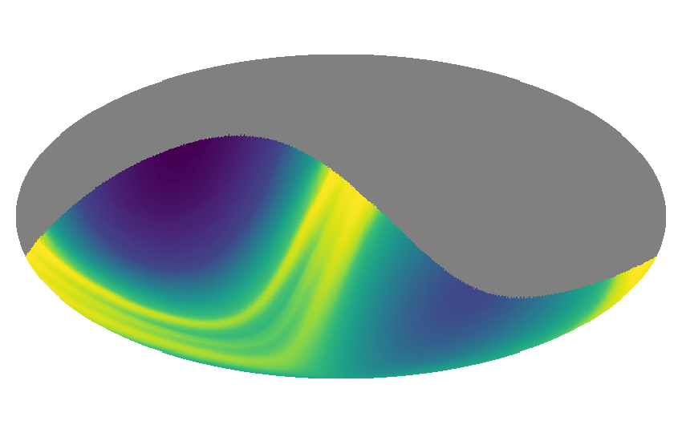
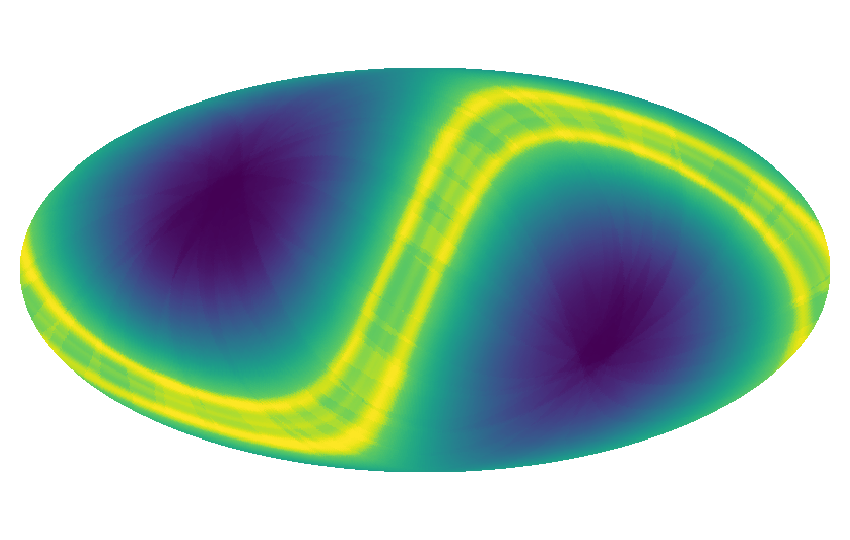

[](https://badge.fury.io/py/zodipy)
[](http://www.astropy.org/)

# Zodipy

## Description
Zodipy is a python tool that simulates the instantaneous Zodiacal emission as
seen by an observer.

## Installing
Zodipy is installed with `pip`.
```bash
pip install zodipy
```

## Examples
The following examples provides an overview of how Zodipy may be used to produce
various simulations of the Zodiacal emission.

## Simulating a single observation
The simplest use case of Zodipy is to simulate the instantaneous emission as
seen from the Earth-Sun Lagrange point 2, as of today (This is the default
behavior of the `Zodi` object):
```python
import zodipy

zodi = zodipy.Zodi()
emission = zodi.get_emission(nside=128, freq=800)
```
We started by initializing the `Zodi` object with default arguments, after which
we have called the `get_emission` method of the `Zodi` object, which simulates
the emission at a given map resolution (nside) and frequency. 

We can visualize the emission using Healpy:


Alternatively, a specific observer, and a date (`datetime` object) can be passed
as arguments to the `Zodi` object, which initializes the new configuration:
```python
import zodipy
from datetime import datetime

zodi = zodipy.Zodi('Planck', datetime(2010, 1, 1))
emission = zodi.get_emission(nside=128, freq=800)
```


It is possible to return the Zodiacal emission component-wise by setting the
keyword `return_comps` in the `get_emission` function to True.

## Masked observations
We can specify the angle between the observer and the Sun for which all pixels
are masked out. This is done in the `get_emission` function by providing the
keyword argument `solar_cut`, which takes in an angle. In the following we
attempt to mimic typical satellite scanning strategies by masking out all pixels
that look inwards towards the Sun:
```python
import zodipy
from datetime import datetime

zodi = zodipy.Zodi('Planck', datetime(2010, 1, 1))
emission = zodi.get_emission(nside=128, freq=800, solar_cut=90)
```


## Simulating the mean over multiple observations
We can simulate the mean emission over a set of observations by initializing the
`Zodi` object with the following keywords:
```python
import zodipy
from datetime import datetime

zodi = zodipy.Zodi(
    observer='Planck', 
    start=datetime(2010, 1, 1), 
    stop=datetime(2011, 1, 1), 
    step='10d'
)
emission = zodi.get_emission(nside=128, freq=800, solar_cut=90)
```
Here we take the mean of linearly spaced observations from 2010-01-01 to
2011-01-01 with a step size of 10 days (note that this is a more expensive
operation and may take up to a few minutes depending on the map resolution and
number of observations). 

## Interplanetary dust models
Zodipy uses the [Kelsall et al.
(1998)](https://ui.adsabs.harvard.edu/abs/1998ApJ...508...44K/abstract)
Interplanetary dust model. The line-of-sight integrals are computed using the
definition in [Planck 2013 results. XIV. Zodiacal
emission](https://arxiv.org/abs/1303.5074). During the Planck analysis, three
different sets of emissivities were fit to describe the emission. These can be
selected by providing the keyword argument `model` to the `Zodi` object:
```python
import zodipy

zodi = zodipy.Zodi(model='planck 2013')
```
The available models are 'planck 2013', 'planck 2015', and 'planck 2018'. The
default is the 2018 model. Note that selecting the 2013 model will include the
Circumsolar and Earth-trailing components, which were left out in the 2015 and
2018 Planck analyses.