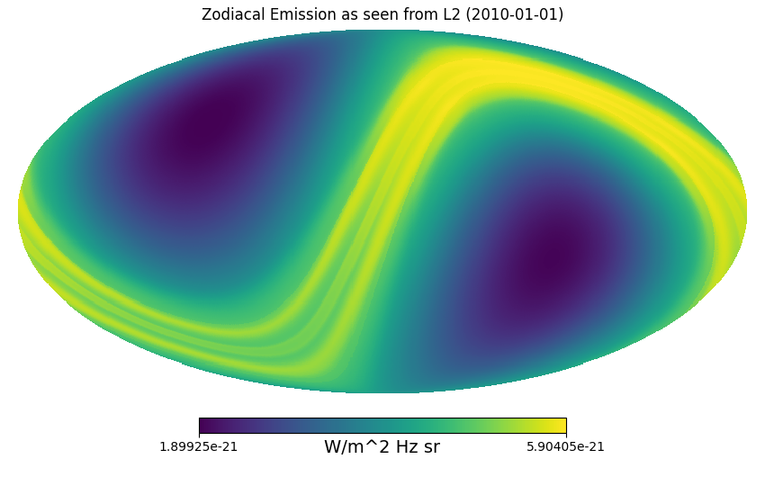

# Zodipy

## Description
Zodipy is a python tool that simulates the instantaneous Zodiacal emission as seen by an observer.

## Installing
Zodipy is installed with `pip`.
```bash
pip install zodipy
```

## Usage
The following will produce a HEALPIX map of the simulated Zodiacal emission at
800 GHz as seen from L2 at 2010-01-01.
```python
import zodipy
from datetime import datetime

zodi = zodipy.Zodi('L2', datetime(2010, 1, 1))
emission = zodi.get_emission(nside=128, freq=800)
```

The simulated emission can be visualized using Healpy and matplotlib.
```python
import healpy as hp
import matplotlib.pyplot as plt

hp.mollview(
    emission, 
    norm='hist', 
    unit='MJy/sr', 
    title='Zodiacal Emission as seen from L2 (2010-01-01)', 
)
plt.show()
```
