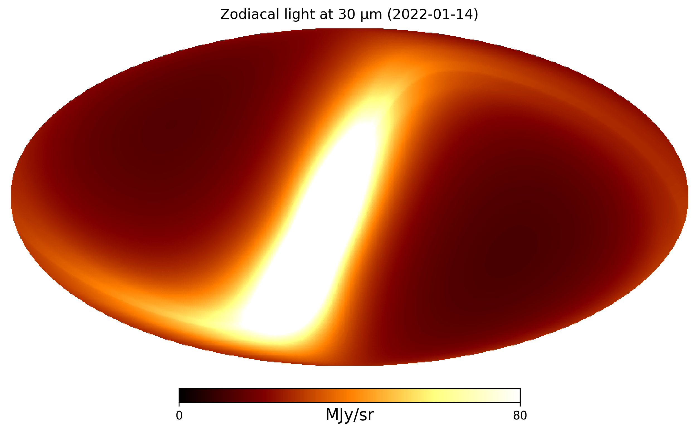
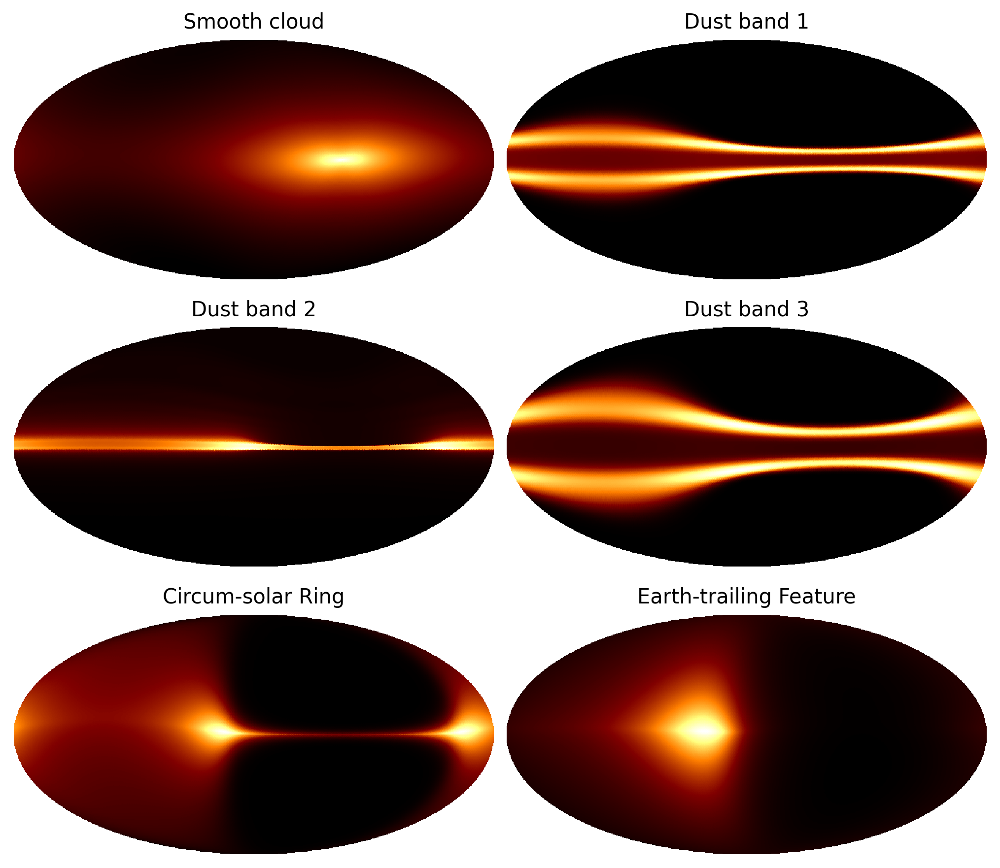
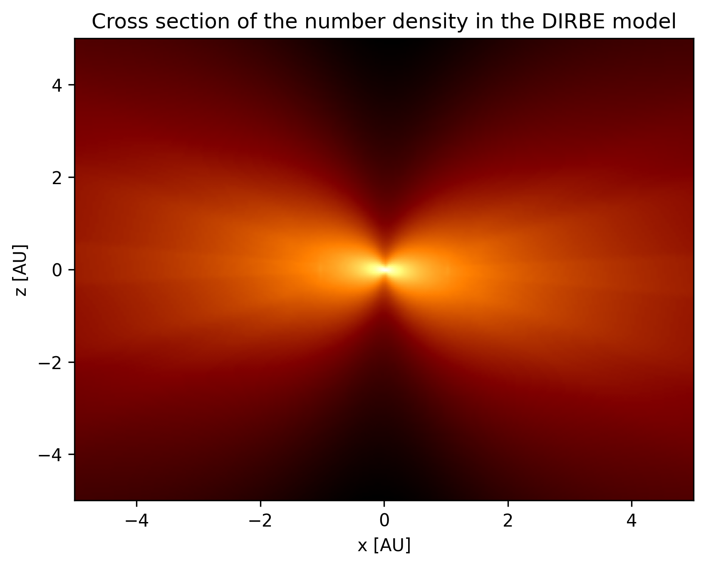

!!! warning "Breaking API changes in `v1.0.0` and newer"
    From version `v1.0.0` and out ZodiPy no implements the `get_emission_ang` and `get_emission_pix` methods. See the section on [HEALPix maps](usage.md#healpix-maps) for an example of how to make simulations from HEALPix pixel indices. We apologize for the inconvenience.  

As an Astropy-affiliated package, ZodiPy is highly integrated with the astropy ecosystem.
To make zodiacal light simulations, the `astropy.units`, `astropy.coordinates`, and `astropy.time` modules are used to provide user input. The coordinates for which ZodiPy will simulate the zodiacal light is specified in through the `astropy.coordinates.SkyCoord` object. Using ZodiPy is very simple and the user will only interact with *one* object `zodipy.Model`, which has *one* method `evaluate`.

## Initializing Zodipy
### Working with the `Model` class
The interface to ZodiPy is the `zodipy.Model` class
```py hl_lines="2 4"
import astropy.units as u
import zodipy

model = zodipy.Model(25 * u.micron)
```
It has *one* required positional argument `x`, which represents a center wavelength/frequency or the points of an empirical bandpass. If `x` represents the points of a bandpass, the `weights` argument must also be provided
```py hl_lines="4 5 7"
import astropy.units as u
import zodipy

points = [3, 4, 5, 6] * u.micron
weights = [0.2, 0.4, 0.3, 0.1]

model = zodipy.Model(points, weights=weights)
```

ZodiPy supports several zodiacal light models (see the [introduction](introduction.md) page for more information regarding the supported models), which are all valid in wavelength/frequency ranges. By default, the `Model` object will initialize using the DIRBE model. To select a different model, we specify the keyword argument `name`
```py hl_lines="4"
import astropy.units as u
import zodipy

model = zodipy.Model(25 * u.micron, name="planck18")
```

### Multiprocessing
ZodiPy will distribute the input coordinates to cores if the keyword argument `n_proc` is `>= 1` using Python's `multiprocessing` module.

=== "Specifying number of processes"
    ```py hl_lines="4"
    import astropy.units as u
    import zodipy

    model = zodipy.Model(25 * u.micron, n_proc=4)
    ```
=== "Custom pool object"

    ```py hl_lines="1 6 7"
    import multiprocessing

    import astropy.units as u
    import zodipy

    pool = multiprocessing.Pool(4)
    model = zodipy.Model(25 * u.micron, pool=pool)
    ```

!!! tip 
    For all available optional keyword arguments in `zodipy.Model` see [the API reference](reference.md#zodipy.zodipy.Model).

## Simulating zodiacal light
To make zodiacal light simulations ZodiPy needs to know three things: 1) Sky coordinates for which to simulate zodiacal light; 2) The position of the observer to know where the vertex of the rays is positioned; and 3) the time of observation, used to query the position of Earth. 

### The SkyCoord object
The sky coordinates are provided through Astropy's powerful `astropy.coordinates.SkyCoord` object, which can represent the observed coordinates in several formats. Users unfamiliar with the `SkyCoord` object should visit the [official Astropy documentation](https://docs.astropy.org/en/stable/coordinates/index.html) before using ZodiPy to learn the basics.

When using the `SkyCoord` in ZodiPy, the user **must** set the `obstime` and `frame` attributes. For a single observation in galactic coordinates, the `SkyCoord` object may look something like
```py hl_lines="2 5 6 7 8 9 10"
import astropy.units as u
from astropy.coordinates import SkyCoord
from astropy.time import Time

skycoord = SkyCoord(
    40 * u.deg, 
    60 * u.deg, 
    obstime=Time("2020-01-01"), 
    frame="galactic"
)
```
The `astropy.time.Time` object can represent time in many formats, including Julian and modified Julian dates (see the [documentation](https://docs.astropy.org/en/stable/time/) on times with Astropy).

The user should use the following coordinate frames when transforming between Ecliptic, Galatic, and Celestial coordinates in string representation:

- "barycentricmeanecliptic"
- "galactic"
- "icrs"

or using the frame objects imported from `astropy.coordinataes`:

- `BarycentricMeanEcliptic`
- `Galactic`
- `ICRS`

!!! info "Notes on coordinate frames"
    The user input is assumed to be observer-centric, meaning that we do not care about the origin of the frame passed in. This is instead supplied through the `obspos` keyword in the `evaluate` method. The above built-in Astropy frames share an origin and can therefore trivially be converted internally in ZodiPy.

In the following, we show three sets of observations in all three coordinate frames
```py hl_lines="2 9 15 21"
import astropy.units as u
from astropy.coordinates import SkyCoord, BarycentricMeanEcliptic, Galactic, ICRS
from astropy.time import Time

skycoord_ecliptic = SkyCoord(
    40 * u.deg, 
    60 * u.deg, 
    obstime=Time("2020-01-01"), 
    frame=BarycentricMeanEcliptic
)
skycoord_galactic = SkyCoord(
    203 * u.deg, 
    10 * u.deg, 
    obstime=Time("2020-01-01"), 
    frame=Galactic
)
skycoord_celestial = SkyCoord(
    12 * u.deg, 
    40 * u.deg, 
    obstime=Time("2020-01-01"), 
    frame=ICRS
)
```

### The `evaluate` method
Zodiacal light is evaluated by passing in the `SkyCoord` object to the `zodipy.Model.evaluate` method.

!!! note 
    ZodiPy assumes that all coordinates provided to a single `evalute` call are obtained at an instant in time from the position of the observer. The zodiacal light moves by about ~1 degree on the sky each day, meaning that long time-ordered pointing Sequences need to be rechunked.
    For the best result, each call to `evaluate` should contain pointing observed within ~ 1 hour of the `obstime` provided in the `SkyCoord` object. 


```py hl_lines="15"
import astropy.units as u
from astropy.coordinates import SkyCoord
from astropy.time import Time
import zodipy

model = zodipy.Model(25 * u.micron)

skycoord = SkyCoord(
    40 * u.deg, 
    60 * u.deg, 
    obstime=Time("2020-01-01"), 
    frame="galactic"
)

emission = model.evaluate(skycoord)
print(emission)
# <Quantity [25.08189292] MJy / sr>
```
By default, the observer is assumed to be on Earth. The position of the observer can be explicitly provided as the keyword argument `obspos` in the `evaluate` method

```py hl_lines="15 19"
import astropy.units as u
from astropy.coordinates import SkyCoord
from astropy.time import Time
import zodipy

model = zodipy.Model(25 * u.micron)

skycoord = SkyCoord(
    40 * u.deg, 
    60 * u.deg, 
    obstime=Time("2020-01-01"), 
    frame="galactic"
)

emission = model.evaluate(skycoord, obspos="mars")
print(emission)
# <Quantity [8.36985535] MJy / sr>

emission = model.evaluate(skycoord, obspos=[0.87, -0.53, 0.001] * u.AU)
print(emission)
# <Quantity [20.37750965] MJy / sr>
```
This argument accepts both a string representing a body recognized by `astropy.coordinates.solar_system_ephemeris` (see the Astropy [documentation](https://docs.astropy.org/en/stable/api/astropy.coordinates.solar_system_ephemeris.html)), or a heliocentric ecliptic cartesian position.

!!! tip
    If the coordinates in the `SkyCoord` object contain a large number of re-observations, as is the case for many satellite observations, setting the `contains_duplicates` keyword in the `evaluate` method to `True` will speed up the evaluations.

## Examples

### Emission along an Ecliptic scan
In the following, we simulate a scan across the Ecliptic plane

``` py title="ecliptic_scan.py"
{!examples/ecliptic_scan.py!}
```


### HEALPIx maps
We can use [healpy](https://healpy.readthedocs.io/en/latest/) or [Astropy-healpix](https://astropy-healpix.readthedocs.io/en/latest/) package to create a `SkyCoord` object directly from a HEALPIx pixelization

=== "healpy"

    ```py
    --8<-- "docs/examples/healpy_map.py"
    ```

=== "healpy + astropy-healpix"

    ```py
    --8<-- "docs/examples/astropy_healpix_map.py"
    ```



### Component-wise zodiacal light
We can return the zodiacal light for each component by using setting the keyword argument `return_comps` to `True`
``` py title="component_maps.py"
{!examples/component_maps.py!}
```




### Visualizing the interplanetary dust distribution
We can visualize the number density of a supported zodiacal light model by using the `grid_number_density` function
``` py title="number_density.py"
{!examples/number_density.py!}
```



