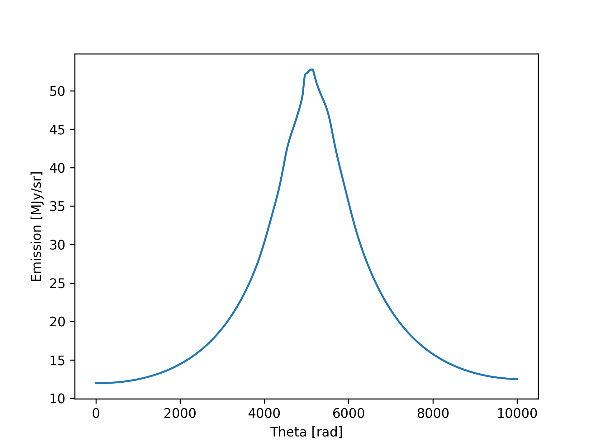
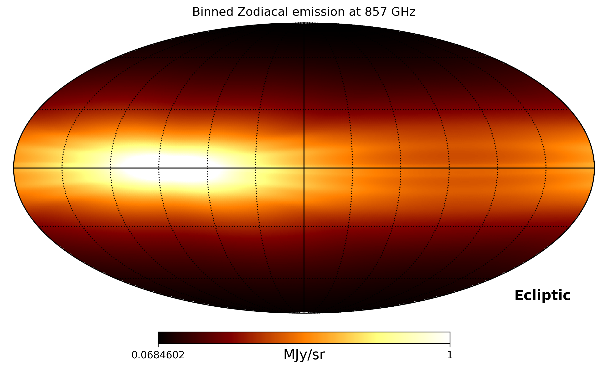
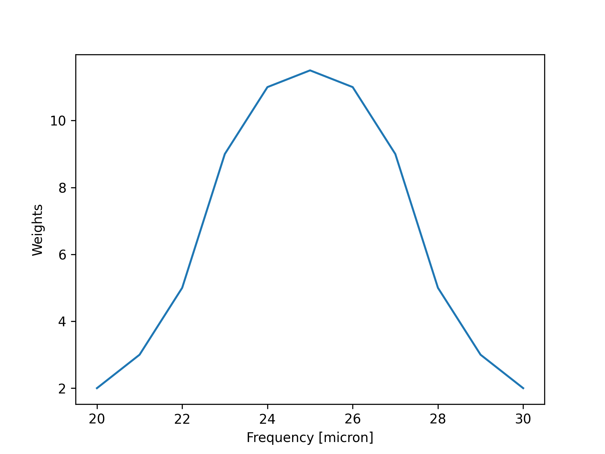
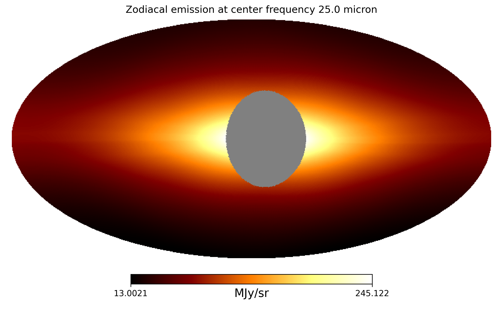
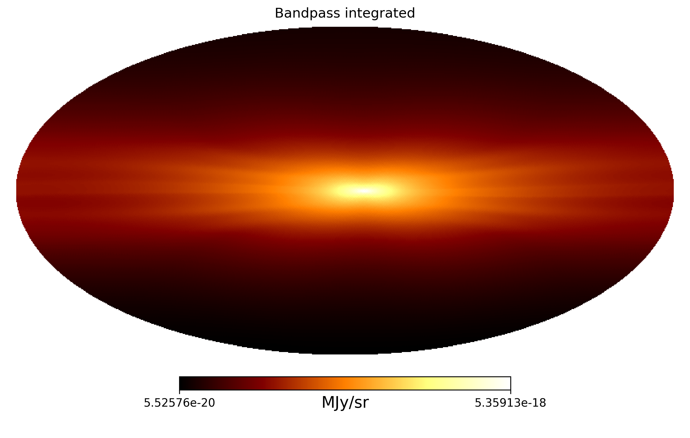
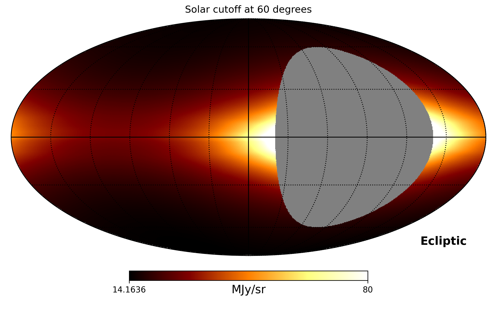
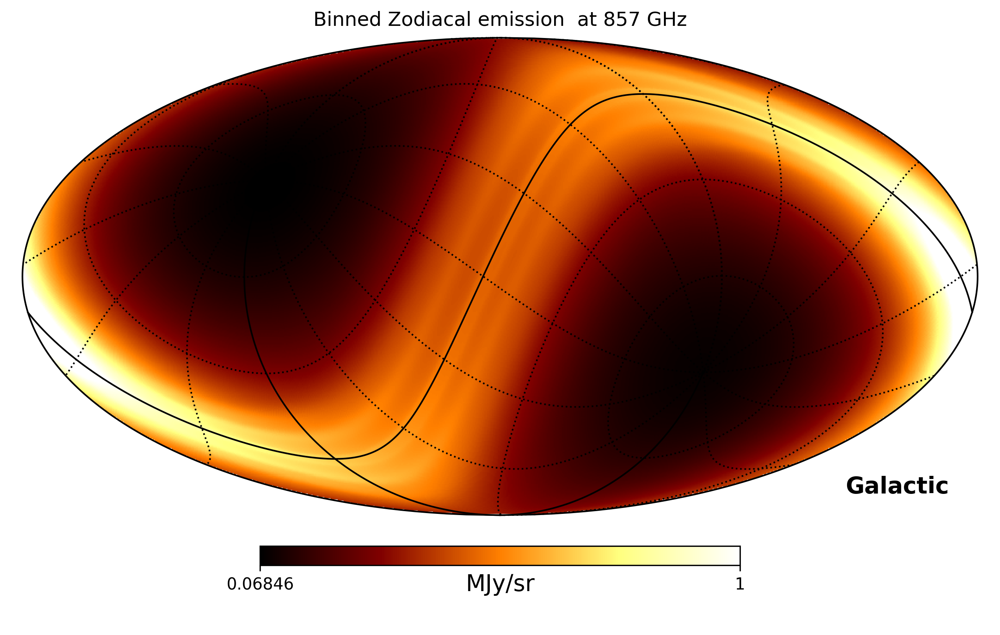
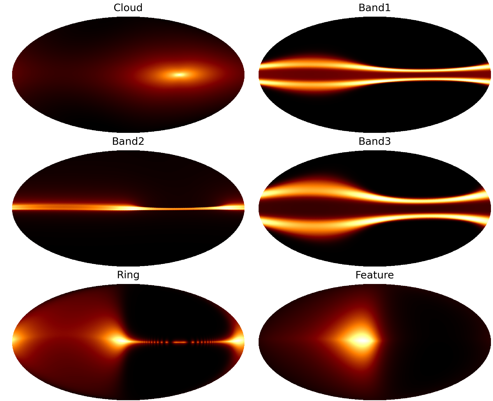
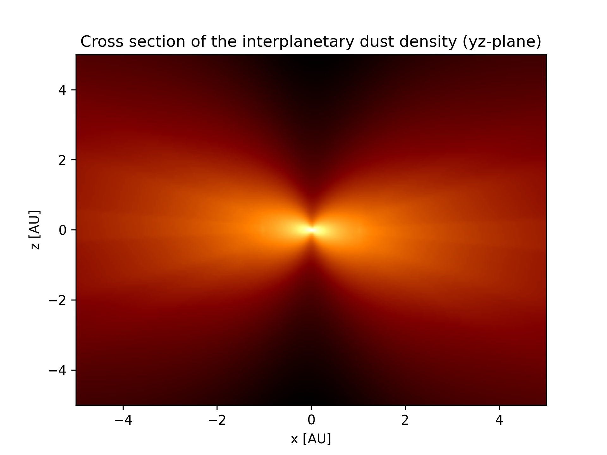

## Timestreams
Below we illustrate how ZodiPy can be used to create timestreams of the zodiacal emission. 
Note that since ZodiPy assumes a constant observer position over the input pointing sequence, the output
will not be *real* timestreams, but for small enough time intervals the error is negligible.


### Emission along a meridian
In the following example we simulate what an observer on Earth is expected to see on 14 June, 
2022 when looking along a meridian (line of constant longitude) at 30 microns, given the 
DIRBE interplanetary dust model.

```python
{!examples/get_emission_ang.py!}
```



!!! note
    ZodiPy assumes a constant observer position over an input pointing sequence. For an observer on Earth, 
    the true zodiacal emission signal will move along the ecliptic on the sky by roughly one degree each day. 
    To account for this effect, the full pointing sequence of an experiment should be chunked into small 
    subsequences with timescales corresponding to at maximum a day.


## HEALPix maps
Below we illustrate how ZodiPy can be used to create simulated binned HEALPix maps of the zodiacal emission.


### Instantaneous map in ecliptic coordinates
In the following example we make an instantaneous map of of the zodiacal emission at 857 GHz
as seen by an observer on earth on 14 June, 2022 given the Planck 2018 interplanetary dust model.

```python
{!examples/get_binned_emission.py!}
```

*Note that the color bar is logarithmic.*


### Bandpass integrated emission
Instruments do not typically observe at delta frequencies. Usually, we are more interested in finding out
what the emission looks like over some instrument bandpass. ZodiPy will accept a sequence of frequencies to the `freq`
argument in addition to the corresponding bandpass weights to the `weights` argument and perform bandpass integration. 
Note that the bandpass weights must be in spectral radiance units (Jy/sr), even though the weights them self are unitless. A top hat bandpass is assumed if a sequence of frequencies are used without providing weights.
```python hl_lines="11 12 13 31 32"
{!examples/get_bandpass_integrated_emission.py!}
```




### Solar cutoff angle
Few experiments look directly in towards the Sun. We can initialize `Zodipy` with the `solar_cut` 
argument to mask all input pointing that looks in towards the sun with an angular distance smaller 
than the `solar_cut` value.

```python hl_lines="9"
{!examples/get_binned_emission_solar_cutoff.py!}
```



### Non-ecliptic coordinates
We can specify the coordinate system of the input pointing with the `coord_in` keyword

```python hl_lines="18"
{!examples/get_binned_gal_emission.py!}
```



### Component-wise maps
ZodiPy can also return the zodiacal emission component-wise. In the following example we use
the DIRBE model since the later Planck models excluded the circumsolar-ring and Earth-trailing 
feature components. For more information on the interplanetary dust models, please 
read [Cosmoglobe: Simulating Zodiacal Emission with ZodiPy](https://arxiv.org/abs/2205.12962).

```python hl_lines="18"
{!examples/get_comp_binned_emission.py!}
```

*Note that the color for the Cloud component is logarithmic, while the others are linear.*


## Parallelization
If you are not using ZodiPy in an already parallelized environment **and** are working with large pointing sequences, setting `parallel=True` when initializing `Zodipy` will improve the performance. ZodiPy will then automatically distribute the pointing to all available CPU's, given by `multiprocessing.cpu_count()` or to `n_proc` if this argument is provided.

```python hl_lines="15 16"
{!examples/get_parallel_emission.py!}
```

!!! warning "Windows users"
    Windows users must make sure to wrap the `get_*_emission_*` function calls in a `if __name__ == "__main__"` guard to avoid spawning infinite processes: 
    ```python
    ...
    if __name__ == "__main__":
        emission = model.get_emission_pix(
            ...
        )
    ```

!!! warning "Using ZodiPy in parallelized environments"
    If ZodiPy is used in a parallelized environment one may have to specifically set the environment variable 
    `OMP_NUM_THREADS=1` to avoid oversubscription. This is due automatic parallelization in third party libraries such as `healpy` where for instance the `hp.Rotator` object automatically parallelizes rotation of unit vectors.
    This means that when using ZodiPy with pointing in a coordinate system other than ecliptic, even if `Zodipy` is initialized with `parallel=False`, `healpy` will under the hood automatically distribute the pointing to available CPU's.


## Visualizing the interplanetary dust distribution of a model
It is possible to visualize the three-dimensional interplanetary dust distribution of the models used in
ZodiPy by using the `tabulate_density` function which takes in a interplanetary dust model and a custom grid.

In the following example we tabulate the density distribution of the DIRBE interplanetary dust model
and plot the cross section of the diffuse cloud components density in the yz-plane.

```python
{!examples/get_density_contour.py!}
```
