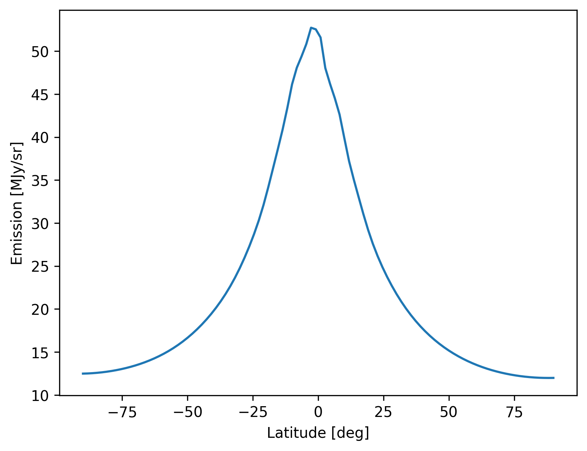

!!! warning "Breaking API changes in `v1.0.0`"
    From version `v1.0.0` and out ZodiPy no implements the `get_emission_ang` and `get_emission_pix` methods. See the section on [HEALPix maps](usage.md#healpix-maps) for an example of how to make simulations from HEALPix pixel indices. These are changes following the integration of ZodiPy into the Astropy ecosystem.

As an Astropy-affiliated package, ZodiPy is highly integrated with the astropy ecosystem.
To make zodiacal light simulations, the `astropy.units`, `astropy.coordinates`, and `astropy.time` modules are used to provide user input. The coordinates for which ZodiPy will simulate the zodiacal light is specified in through the `astropy.coordinates.SkyCoord` object. Using ZodiPy is very simple and the user will only interact with *one* object `zodipy.Model`, which has *one* method `evaluate`.

## Initializing Zodipy
### Working with the `Model` class
The interface to ZodiPy is the `zodipy.Model` class
```py hl_lines="2 4"
import astropy.units as u
import zodipy

model = zodipy.Model(25 * u.micron)
```
It has *one* required positional argument `x`, which represents a center wavelength/frequency or the points of an empirical bandpass. If `x` represents the points of a bandpass, the `weights` argument must also be provided
```py hl_lines="4 5 7"
import astropy.units as u
import zodipy

points = [3, 4, 5, 6] * u.micron
weights = [0.2, 0.4, 0.3, 0.1]

model = zodipy.Model(points, weights=weights)
```

ZodiPy supports several zodiacal light models (see the [introduction](introduction.md) page for more information regarding the supported models), which are all valid in wavelength/frequency ranges. By default, the `Model` object will initialize using the DIRBE model. To select a different model, we specify the keyword argument `name`
```py hl_lines="4"
import astropy.units as u
import zodipy

model = zodipy.Model(25 * u.micron, name="planck18")
```
## Simulating zodiacal light
To make zodiacal light simulations ZodiPy needs to know three things: 1) Sky coordinates for which to simulate zodiacal light; 2) The position of the observer to know where the vertex of the rays is positioned; and 3) the time of observation, used to query the position of Earth. 

### The SkyCoord object
The sky coordinates for which to simulate zodiacal light is given to ZodiPy using Astropy's `astropy.coordinates.SkyCoord` object. Users unfamiliar with the `SkyCoord` object should visit the [official Astropy documentation](https://docs.astropy.org/en/stable/coordinates/index.html) before using ZodiPy to learn the basics.


For a single observation in galactic coordinates, the `SkyCoord` object may look something like
```py hl_lines="2 5 6 7 8 9 10"
import astropy.units as u
from astropy.coordinates import SkyCoord
from astropy.time import Time

skycoord = SkyCoord(
    40 * u.deg, 
    60 * u.deg, 
    obstime=Time("2020-01-01"), 
    frame="galactic"
)
```
The `obstime` keyword is mandatory, and is given by an `astropy.time.Time` object, which can represent time in many formats, including Julian and modified Julian dates (see the [Astropy documentation](https://docs.astropy.org/en/stable/time/)).
Correspondingly for several observations, each with their own `obstime` input:
```py hl_lines="6 7 8"
import astropy.units as u
from astropy.coordinates import SkyCoord
from astropy.time import Time

skycoord = SkyCoord(
    [40, 41, 42] * u.deg, 
    [60, 59, 58] * u.deg, 
    obstime=Time(["2020-01-01", "2020-01-02", "2020-01-03"]), 
    frame="galactic"
)
```
If a single value is given for `obstime`, all coordinates are assumed to be viewed instantaneously at that time from a single position in the Solar system. Otherwise, each coordinate must have its own `obstime` value.

The sky coordinates should represent observer-centric coordinates. The observer-position is therefore required to compute the line-of-sight integrals, but this is provided not in the `SkyCoord` object, but rather in the `evaluate` method which we will see soon.

Common coordinate frames are the Ecliptic, Galactic, and Celestial frames ("E", "G", "C" in `healpy`), which can be specified through string representations:

- `"barycentricmeanecliptic"` (Ecliptic)
- `"galactic"` (Galactic)
- `"icrs"` (Celestial)

or using the frame objects imported from `astropy.coordinates`:

- `BarycentricMeanEcliptic`
- `Galactic`
- `ICRS`

!!! info "Notes on coordinate frames"
    While the above listed built-in Astropy frames do *not* represent observer-centric coordinate frames,
    we still use these to specify the frame rotation, which is required internally as the model is evaluated in
    ecliptic coordinates.

In the following, we show three sets of observations in all three coordinate frames
```py hl_lines="2 9 15 21"
import astropy.units as u
from astropy.coordinates import SkyCoord, BarycentricMeanEcliptic, Galactic, ICRS
from astropy.time import Time

skycoord_ecliptic = SkyCoord(
    40 * u.deg, 
    60 * u.deg, 
    obstime=Time("2020-01-01"), 
    frame=BarycentricMeanEcliptic
)
skycoord_galactic = SkyCoord(
    203 * u.deg, 
    10 * u.deg, 
    obstime=Time("2020-01-01"), 
    frame=Galactic
)
skycoord_celestial = SkyCoord(
    12 * u.deg, 
    40 * u.deg, 
    obstime=Time("2020-01-01"), 
    frame=ICRS
)
```

### The `evaluate` method
The zodiacal light is evaluated by providing the `SkyCoord` object to the `zodipy.Model.evaluate` method.

```py hl_lines="15"
import astropy.units as u
from astropy.coordinates import SkyCoord
from astropy.time import Time
import zodipy

model = zodipy.Model(25 * u.micron)

skycoord = SkyCoord(
    40 * u.deg, 
    60 * u.deg, 
    obstime=Time("2020-01-01"), 
    frame="galactic"
)

emission = model.evaluate(skycoord)
print(emission)
# <Quantity [25.08189292] MJy / sr>
```
By default, the observer is assumed to be the center of the Earth. The position of the observer can be explicitly provided as the keyword argument `obspos` in the `evaluate` method

```py hl_lines="15 19"
import astropy.units as u
from astropy.coordinates import SkyCoord
from astropy.time import Time
import zodipy

model = zodipy.Model(25 * u.micron)

skycoord = SkyCoord(
    40 * u.deg, 
    60 * u.deg, 
    obstime=Time("2020-01-01"), 
    frame="galactic"
)

emission = model.evaluate(skycoord, obspos="mars")
print(emission)
# <Quantity [8.36985535] MJy / sr>

emission = model.evaluate(skycoord, obspos=[0.87, -0.53, 0.001] * u.AU)
print(emission)
# <Quantity [20.37750965] MJy / sr>
```
This argument accepts both a string representing a body recognized by `astropy.coordinates.solar_system_ephemeris` (see the Astropy [documentation](https://docs.astropy.org/en/stable/api/astropy.coordinates.solar_system_ephemeris.html)), or a heliocentric ecliptic cartesian position.

Similar to with the `obstime` attribute in the `SkyCoord` object, the `obspos` keyword have shape `(3,)` or `(3, ncoords)`. If a string representation of a body is used, with several values `obstime` ZodiPy will internally compute a position for each coordinate.


### Multiprocessing
ZodiPy will distribute the input coordinates to cores if the keyword argument `nprocesses` in the `evaluate` method is `nprocesses >= 1` using Python's `multiprocessing` module.
```py hl_lines="1 17"
import multiprocessing

import astropy.units as u
from astropy.coordinates import SkyCoord
from astropy.time import Time
import zodipy

model = zodipy.Model(25 * u.micron)

skycoord = SkyCoord(
    40 * u.deg, 
    60 * u.deg, 
    obstime=Time("2020-01-01"), 
    frame="galactic"
)

emission = model.evaluate(skycoord, nprocesses=multiprocessing.cpu_count())
```

!!! tip 
    For all available optional keyword arguments in `zodipy.Model` see [the API reference](reference.md#zodipy.zodipy.Model).


## Examples

### Emission along an Ecliptic scan
In the following, we simulate a scan across the Ecliptic plane

``` py title="ecliptic_scan.py"
{!examples/ecliptic_scan.py!}
```




### HEALPix maps
We can use [healpy](https://healpy.readthedocs.io/en/latest/) or [Astropy-healpix](https://astropy-healpix.readthedocs.io/en/latest/) to create a `SkyCoord` object directly from a HEALPIx pixelization

=== "healpy"

    ```py
    --8<-- "docs/examples/healpy_map.py"
    ```

=== "astropy-healpix"

    ```py
    --8<-- "docs/examples/astropy_healpix_map.py"
    ```


### Component-wise zodiacal light
We can return the zodiacal light for each component by using setting the keyword argument `return_comps` to `True`
``` py title="component_maps.py"
{!examples/component_maps.py!}
```


### Visualizing the interplanetary dust distribution
We can visualize the number density of a supported zodiacal light model by using the `grid_number_density` function
``` py title="number_density.py"
{!examples/number_density.py!}
```


