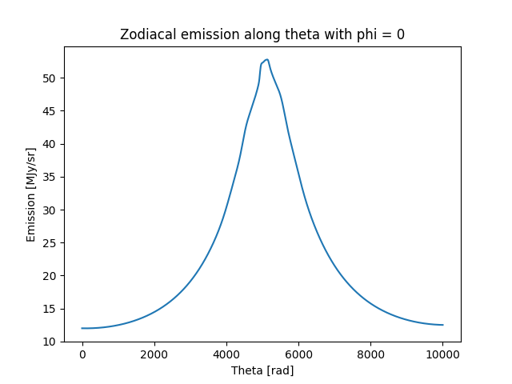
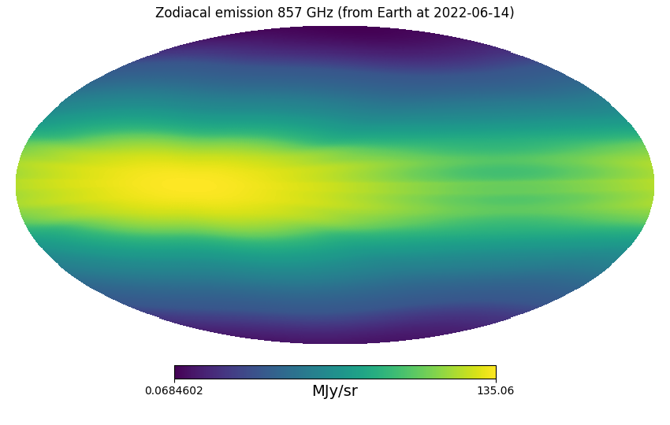

# Usage

Below we illustrate a few use-cases of ZodiPy.


## Timestream

In the following example we make a timestream representing one sweep perpendicular to the ecliptic (`phi=0`) 
as seen by an observer on earth 2022-06-14 given the DIRBE interplanetary dust model.

```python
import astropy.units as u
import matplotlib.pyplot as plt
import numpy as np
from astropy.time import Time

from zodipy import Zodipy

model = Zodipy("dirbe")

theta = np.linspace(0, np.pi, 10000) * u.rad
phi = np.zeros_like(theta)

emission = model.get_emission_ang(
    30 * u.micron,
    theta=theta,
    phi=phi,
    obs_time=Time("2022-06-14"),
    obs="earth",
)

plt.plot(emission)
plt.title("Zodiacal emission along theta with phi = 0")
plt.xlabel("Theta [rad]")
plt.ylabel("Emission [MJy/sr]")
plt.show()

```



## Binned HEALPix map

In the following example we make an instantaneous map of of the Zodiacal emission at 857 GHz
as seen by an observer on earth on 2022-06-14 given the Planck 2018 interplanetary dust model.

```python
import astropy.units as u
import healpy as hp
import matplotlib.pyplot as plt
import numpy as np
from astropy.time import Time

from zodipy import Zodipy

model = Zodipy("planck18")
nside = 256
binned_emission = model.get_binned_emission_pix(
    857 * u.GHz,
    pixels=np.arange(hp.nside2npix(nside)),
    nside=nside,
    obs_time=Time("2022-06-14"),
    obs="earth",
)


hp.mollview(
    binned_emission,
    norm="hist",
    title="Zodiacal emission 857 GHz (from Earth at 2022-06-14)",
    unit="MJy/sr"
)
plt.savefig("zodiacal_emission_857_GHz.png")
plt.show()
```


